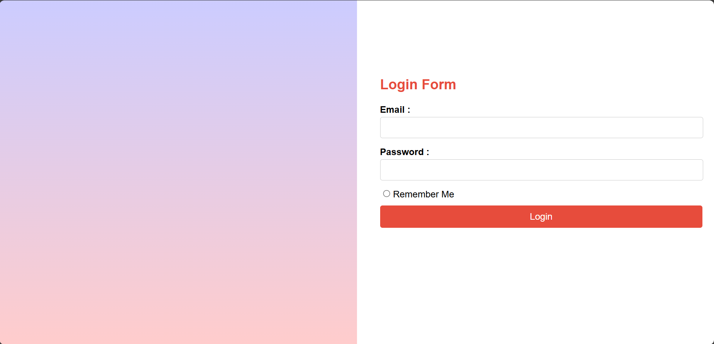
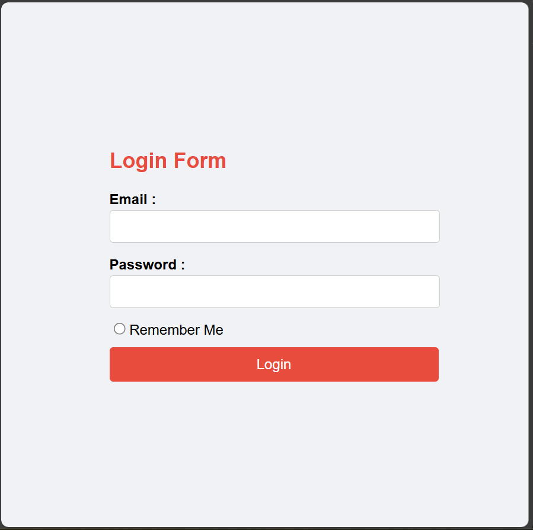

🔑 Responsive CSS Login Page

A responsive login page built with HTML and CSS, using media queries for different screen sizes.

📌 Features

* Responsive layout for desktop, tablet, and mobile

* Styled login form with CSS

🖼 Screenshots

🚀 How to Run

Open login-page.html in your browser.
